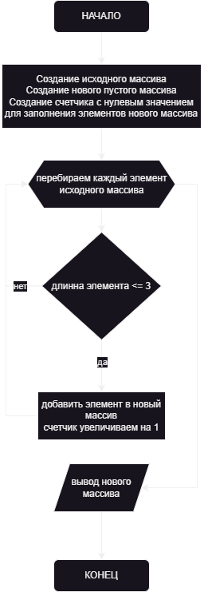

#
# `ЗАДАЧА`

~~~
Написать программу, которая из имеющегося массива строк формирует новый массив из строк, длина которых меньше, либо равна 3 символам. 
Первоначальный массив можно ввести с клавиатуры, либо задать на старте выполнения алгоритма. При решении не рекомендуется пользоваться коллекциями, лучше обойтись исключительно массивами.
~~~

### Вводные данные
```
Строковый массив: "Hello", "2", "world", ":-)"
```
#
# `РЕШЕНИЕ`

## `Описание методов`

1. ***Создаем метод ResultArray, который:***

~~~
- на вход принимает строковый массив;
- создает целоцисленную переменную count и присваивает значение 0, она нужна для параллельного счетчика в новом массиве;
- создает новый строковый массив newArray с длинной, равной длине исходного массива;
- циклом for перебирает массив, пока не достигнет длинны исходного массива, внутри цикла, проверяет оперотором if следующее, длинна элемента исходного массива не должна превышать число 3, при этом условии заполняется новый массив newArray элементом с длинной до 3 символов;
- оператором if уменьшает длинну нового массива до количества элементов;
- возвращает новый строковый массив.
~~~
2. ***Создаем метод PrintArray, который:***

~~~
с помощью цикла for, проходится по строковому массиву и выводит все элементы в консоль, обрамляя их в квадратные скобки.
~~~

## `Тело программы`

~~~
1. Создается новый строковый массив messageArray и заполняется вводными данными.
2. Создается новый строковый массив array, используя метод ResultArray.
3. Очищается консоль.
4. Выводится на печать исходный строковый массив.
5. Выводится на печать разделительнй символ " -> ".
6. Выводится на печать новый строковй массив.
~~~
#

# `Блок-схема`

